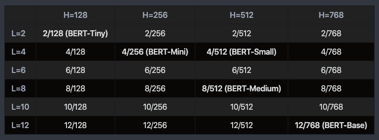
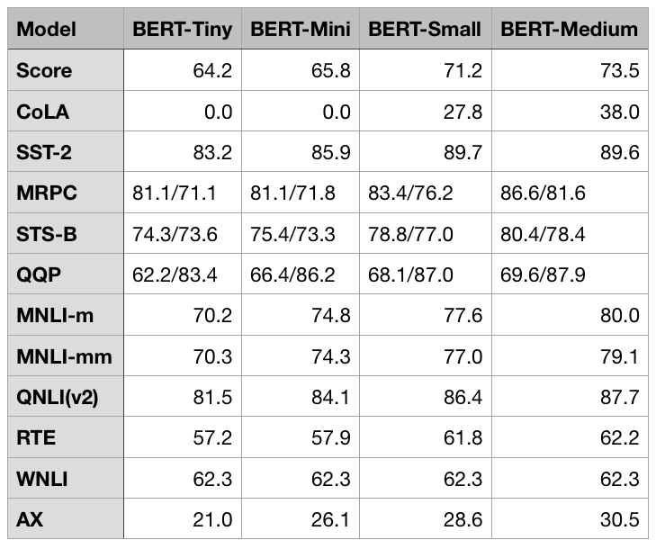

# Pre-trained Little BERTs - 持续更新

此repo收录了谷歌官方提供的**24个预训练好的较小BERT**的百度网盘镜像，具体包括官方提供的TensorFlow版和我用Transformers库转换后的pytorch版本模型参数。

这些小型BERT使用了较小的layers、hidden size或者multi-attention heads，所有24个模型都使用了和BERT-base或BERT-large相同的MLM任务作为预训练目标，**它们的使用方式和BERT-base或BERT-large完全一致**。这些轻量模型有助于算法的快速迭代或应用部署。24个模型的具体参数配置和部分模型的性能如下：

## 下载链接

### PyTorch版

pytorch版的24个模型打包下载链接：[百度网盘]() 提取码：

各模型独立的下载链接：

| Layers | Hidden Size | Attention Heads |                             链接                             |
| :----: | :---------: | :-------------: | :----------------------------------------------------------: |
|   2    |     128     |        2        | [百度网盘](https://pan.baidu.com/s/19b1x0yJafaTcLa5qBysjEQ) 提取码：lnyy |
|   2    |     256     |        4        | [百度网盘](https://pan.baidu.com/s/1D_UmeAyVCPfpkuT9b4GpaQ) 提取码：a8re |
|   2    |     512     |        8        | [百度网盘](https://pan.baidu.com/s/1UlWYiNyMcXT24i-HTOJu1g) 提取码：3b7h |
|   2    |     768     |       12        | [百度网盘](https://pan.baidu.com/s/1X903-Hx9faJEbNPgxYzgJQ) 提取码：vo21 |
|   4    |     128     |        2        | [百度网盘](https://pan.baidu.com/s/1MleEEYL-OZ_7Xxnfx-s87g) 提取码：4sd0 |
|   4    |     256     |        4        | [百度网盘](https://pan.baidu.com/s/1Y4E16jISZAd8iLl4CmRaDA) 提取码：nyu9 |
|   4    |     512     |        8        | [百度网盘](https://pan.baidu.com/s/1AL4nD3xZq3hp8Fi3xmGZMQ) 提取码：r9e8 |
|   4    |     768     |       12        | [百度网盘](https://pan.baidu.com/s/1-qN1BLlXaY_SIGIOws1lqQ) 提取码：pelq |
|   6    |     128     |        2        | [百度网盘](https://pan.baidu.com/s/1Zv4oXFWyj_x0aSTVYqLajA) 提取码：lzr4 |
|   6    |     256     |        4        | [百度网盘](https://pan.baidu.com/s/1UR2Mz3G72AyOOSkHB38xvg) 提取码：e15o |
|   6    |     512     |        8        | [百度网盘](https://pan.baidu.com/s/1MQYprVOODpIoPpI0nIb56Q) 提取码：jxcq |
|   6    |     768     |       12        | [百度网盘](https://pan.baidu.com/s/13jHVZdMn-6tgflhYUjbrtg) 提取码：sow7 |
|   8    |     128     |        2        | [百度网盘](https://pan.baidu.com/s/1fNxzNmd2S1u-c_T2OonYdA) 提取码：iiq6 |
|   8    |     256     |        4        | [百度网盘](https://pan.baidu.com/s/13fZvve1qbkO8-IrWUN1NKQ) 提取码：u4f2 |
|   8    |     512     |        8        | [百度网盘](https://pan.baidu.com/s/1KjvkIP0ooPs1gnFis052Tg) 提取码：pjz6 |
|   8    |     768     |       12        | [百度网盘](https://pan.baidu.com/s/1Km7tRQTmZeuf6UhKNzDebw) 提取码：6srn |
|   10   |     128     |        2        | [百度网盘](https://pan.baidu.com/s/1Bu0-8QStZYiB7Hv-jwKsfQ) 提取码：v3sw |
|   10   |     256     |        4        | [百度网盘](https://pan.baidu.com/s/1uDpxRTTXf45hsV4uYW6AeQ) 提取码：6f2j |
|   10   |     512     |        8        | [百度网盘](https://pan.baidu.com/s/1GaugUGfDbdCSGudOjQI71Q) 提取码：wliw |
|   10   |     768     |       12        | [百度网盘](https://pan.baidu.com/s/10h5pBqbg4Zs7EGHIfUyYzg) 提取码：iznu |
|   12   |     128     |        2        | [百度网盘](https://pan.baidu.com/s/1ttj1iEsDsHvXNXafIcJcEA) 提取码：1m8d |
|   12   |     256     |        4        | [百度网盘](https://pan.baidu.com/s/1xNq90PX7YxwrTljBA9b2Sg) 提取码：9hea |
|   12   |     512     |        8        | [百度网盘](https://pan.baidu.com/s/1JkkGcQjkXWjghIdFvqdecw) 提取码：43fy |
|   12   |     768     |       12        | [百度网盘](https://pan.baidu.com/s/1bqOUL8OuUgoj-chbsKXa0w) 提取码：8z3e |

### TensorFlow版

tf版的24个模型打包下载链接：[百度网盘](https://pan.baidu.com/s/1MjugY49rz51VN6PO2_LRyQ ) 提取码：uyul 

各模型独立的下载链接：

| Layers | Hidden Size | Attention Heads |                             链接                             |
| :----: | :---------: | :-------------: | :----------------------------------------------------------: |
|   2    |     128     |        2        | [百度网盘](https://pan.baidu.com/s/1Qx7S_Anx-tUJz5YA0IY2RQ) 提取码：s5sz |
|   2    |     256     |        4        | [百度网盘](https://pan.baidu.com/s/1hs_cfgDcEEmKSEmDs6TebQ) 提取码：wmrt |
|   2    |     512     |        8        | [百度网盘](https://pan.baidu.com/s/1lA3Fb0Wmx6o8Wmkl1WFczg) 提取码：rne4 |
|   2    |     768     |       12        | [百度网盘](https://pan.baidu.com/s/1miLZBNpmvcwuLAQRUVUChw) 提取码：6h5b |
|   4    |     128     |        2        | [百度网盘](https://pan.baidu.com/s/1FHJfytGY0RMb8K4C9YKLqQ) 提取码：vtwu |
|   4    |     256     |        4        | [百度网盘](https://pan.baidu.com/s/1bW5ZvIx3iohfxXP2lYddzA) 提取码：iy1k |
|   4    |     512     |        8        | [百度网盘](https://pan.baidu.com/s/1HitP0_0_IkgpvYNKUmBTRg) 提取码：4ocf |
|   4    |     768     |       12        | [百度网盘](https://pan.baidu.com/s/1NHPh6d_JraACDb-HvF-RPQ) 提取码：3xcc |
|   6    |     128     |        2        | [百度网盘](https://pan.baidu.com/s/1q01Mwjr_Gc7xkFEpC_vRGg) 提取码：4f59 |
|   6    |     256     |        4        | [百度网盘](https://pan.baidu.com/s/1I-cal5rrR3MfiOGBCQYIKA) 提取码：hu32 |
|   6    |     512     |        8        | [百度网盘](https://pan.baidu.com/s/1FCJM-PqpraC4-zcLYfct0Q) 提取码：zuna |
|   6    |     768     |       12        | [百度网盘](https://pan.baidu.com/s/1fy-T6Be58ovvqtigBurwVA) 提取码：7pbg |
|   8    |     128     |        2        | [百度网盘](https://pan.baidu.com/s/1_w0Cyx56CGaD2kekkkkaxQ) 提取码：aeuy |
|   8    |     256     |        4        | [百度网盘](https://pan.baidu.com/s/1W26ixtR98UvXsLuVGHvBAw) 提取码：r7k3 |
|   8    |     512     |        8        | [百度网盘](https://pan.baidu.com/s/1tfOJTf3zvi0ABFzW_tU1Xw) 提取码：yjdm |
|   8    |     768     |       12        | [百度网盘](https://pan.baidu.com/s/1AQMn3We50rcVm-bZhfH_aQ) 提取码：6530 |
|   10   |     128     |        2        | [百度网盘](https://pan.baidu.com/s/1dvWbbb50ACjNfdB7XFhtog) 提取码：eqiy |
|   10   |     256     |        4        | [百度网盘](https://pan.baidu.com/s/1E2qRca7ZaXrb2Azq3jDXvQ) 提取码：fpha |
|   10   |     512     |        8        | [百度网盘](https://pan.baidu.com/s/1VEbO7bKqibkkzzYoR1YGFg) 提取码：0ipm |
|   10   |     768     |       12        | [百度网盘](https://pan.baidu.com/s/1rD3ix244HIYILUOZ8beFTA) 提取码：1zwq |
|   12   |     128     |        2        | [百度网盘](https://pan.baidu.com/s/1t5dru84Y7bJGrPLgVtgcdg) 提取码：evxu |
|   12   |     256     |        4        | [百度网盘](https://pan.baidu.com/s/1VDB4niUq_5brye51ib9NHQ) 提取码：hplu |
|   12   |     512     |        8        | [百度网盘](https://pan.baidu.com/s/1r0M_BbtwkAi7tvtazFMq3w) 提取码：lfp7 |
|   12   |     768     |       12        | [百度网盘](https://pan.baidu.com/s/1QydjIHQDrrX6zjt3P58GoA) 提取码：z1oe |

